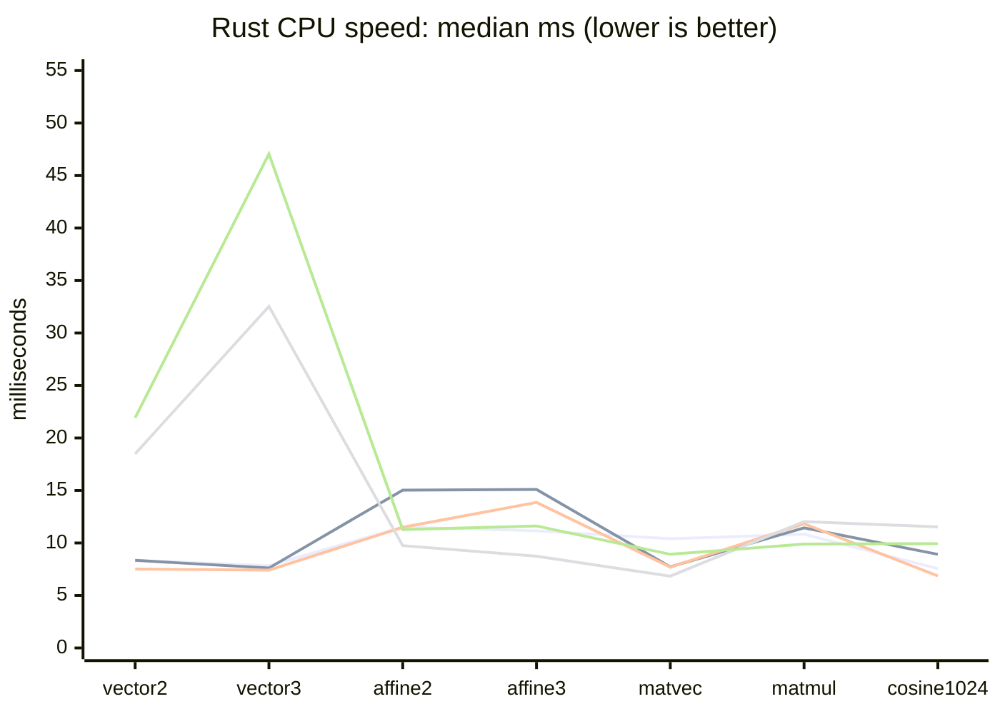
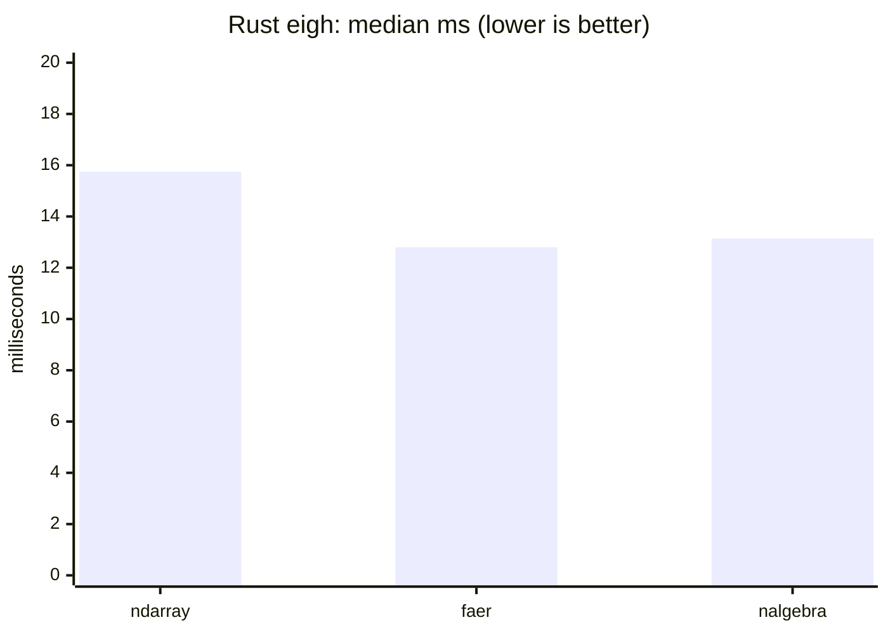
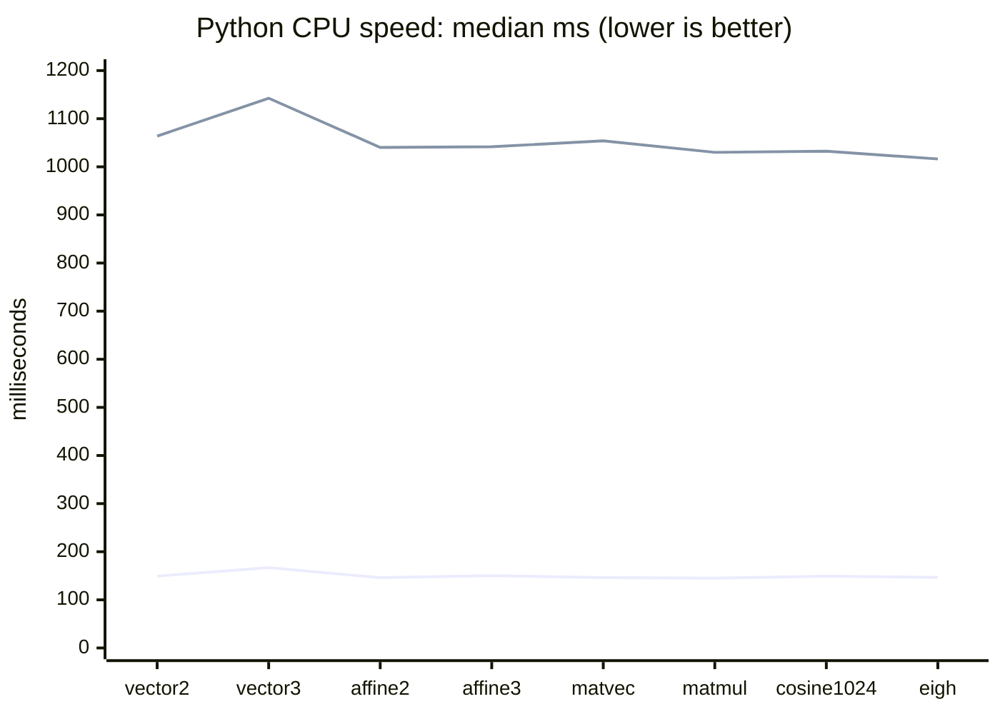
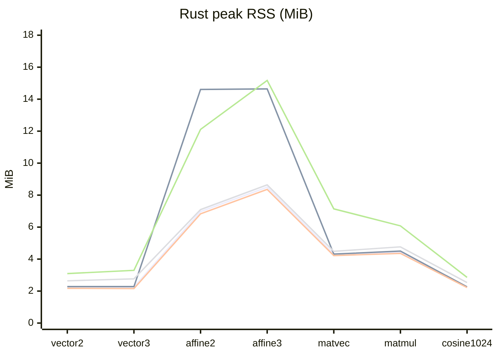
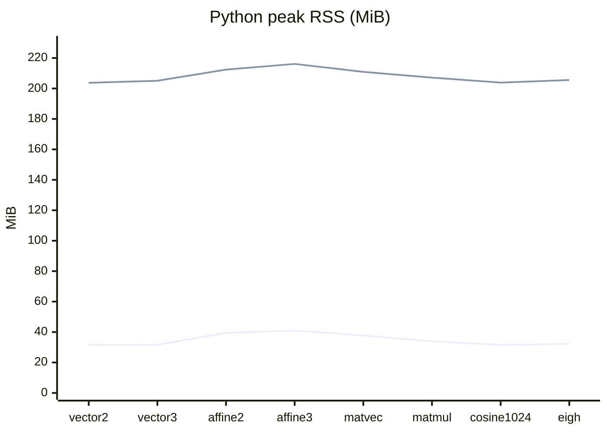

# ndbench

`ndarray`、`faer`、`nalgebra`、`candle-core`、Burn、NumPy、PyTorch の同じ倍精度計算を、同じ決定的な入力で比較するベンチマークです。Rust 側は CPU 5 バックエンド、Python 側は `python/` 内の独立した `uv` プロジェクトで CPU 2 バックエンドを実行します。

## 対象の計算

| operation | 内容 | `--size` の意味 | Rust backend |
| --- | --- | --- | --- |
| `vector2` | 2次元ベクトルの加算・内積・L2ノルム | 未使用。`--iterations` で反復 | ndarray / faer / nalgebra / Candle / Burn |
| `vector3` | 3次元ベクトルの加算・内積・L2ノルム・外積 | 未使用。`--iterations` で反復 | ndarray / faer / nalgebra / Candle / Burn |
| `affine2` | 3×3同次行列で2次元点群を変換 | 点数 | ndarray / faer / nalgebra / Candle / Burn |
| `affine3` | 4×4同次行列で3次元点群を変換 | 点数 | ndarray / faer / nalgebra / Candle / Burn |
| `matvec` | dense square matrix × vector | 行列の次数 | ndarray / faer / nalgebra / Candle / Burn |
| `matmul` | dense square matrix × matrix | 行列の次数 | ndarray / faer / nalgebra / Candle / Burn |
| `cosine1024` | 2本の`f64`・1024次元ベクトルのコサイン類似度 | 固定1024。`--iterations` で反復 | ndarray / faer / nalgebra / Candle / Burn |
| `eigh` | 実対称行列の固有値・固有ベクトルを全て計算 | 行列の次数 | ndarray / faer / nalgebra |

小さいベクトルでは、ライブラリが提供する型・演算子・Tensor、一時オブジェクトのコストも含めて測ります。行列系では論理上の行列値を揃え、`ndarray` は Fortran order、`faer` と `nalgebra` は column-major、Candle と Burn は通常のTensorを使います。`cosine1024` は埋め込みベクトルを想定し、2本の決定的な`f64`ベクトルを生成して、内積を2本のL2ノルムの積で割ります。

Burnは`burn = 0.21.0`の`burn-ndarray` backendを`NdArray<f64>`として使い、`std`・`ndarray`・`simd`だけを有効にしています。したがって、ここでのBurn結果はCPU Tensor実装の比較です。

`eigh` だけは実装条件が異なります。`faer` と `nalgebra` は各ライブラリの純Rust実装、`ndarray` は `ndarray-linalg` の LAPACK/OpenBLAS backend です。Candle の現行 `candle-core 0.11.0` と Burn 0.21.0 の `burn-ndarray` には汎用の対称行列固有値分解 API がないため、未対応のまま測定対象から除外しています。未対応処理を別のアルゴリズムで置き換えて、Candle/Burnの速度として扱うことはしていません。

## 実行方法

Rust の固有値分解を含む比較には OpenBLAS の静的ビルドを使います。macOS では `gfortran`、`make` などが必要です。

この環境ではHomebrewのFortran runtimeを明示する必要があるため、`-lgfortran`のlink errorが出る場合は次のように実行します。

```sh
LIBRARY_PATH="$(dirname "$(gfortran -print-file-name=libgfortran.dylib)")${LIBRARY_PATH:+:${LIBRARY_PATH}}" \
OPENBLAS_FC=/opt/homebrew/bin/gfortran ./scripts/benchmark.sh
```

```sh
cargo test --all-targets
cargo clippy --all-targets -- -D warnings

./scripts/benchmark.sh
./scripts/memory.sh
```

直接実行する場合は次のようにします。

```sh
cargo build --release --features ndarray-eigh-openblas-static

./target/release/ndbench \
  --backend candle --op matmul --size 256 --iterations 1

./target/release/ndbench \
  --backend burn --op cosine1024 --iterations 1000

./target/release/ndbench \
  --backend ndarray --op eigh --size 128 --iterations 1
```

Python 側は `python/` に独立した環境と lockfile を持ちます。スクリプト自体が `uv sync` を実行し、測定コマンドを `uv run` で起動します。

```sh
cd python
uv sync
./benchmark.sh
./memory.sh
```

NumPy と PyTorch の CLI は次のように実行できます。

```sh
uv run python ndbench.py \
  --backend numpy --op matmul --size 256 --iterations 5

uv run python ndbench.py \
  --backend pytorch --op eigh --size 128 --iterations 1
```

## 実測結果

以下はこの checkout の macOS arm64 / Apple M4 Max で取得したスナップショットです。Rust と Python ともに `HYPERFINE_RUNS=5`、warmup 2、`vector2`/`vector3` は 10,000 反復、`cosine1024` は 1,000 反復、それ以外は各スクリプトの既定サイズ・反復回数を使いました。Rust は `ndarray-eigh-openblas-static` でビルドし、OpenBLAS、OpenMP、Candle/Burn/Rayon、PyTorch のスレッド数を 1 に固定しています。

時間は hyperfine の中央値（ms、低いほど速い）です。プロセス起動と入力生成も含むため、kernel 単体の速度ではありません。結果は CPU・OS・コンパイラ・BLAS 実装で変わります。

比較チャートは、複数の棒系列が同じx位置で重なって見えないよう、名前付きの折れ線系列にしています。凡例でbackendを確認でき、値そのものは直前の表で確認できます。

### Rust CPU speed

| operation | ndarray | faer | nalgebra | candle | burn |
| --- | ---: | ---: | ---: | ---: | ---: |
| vector2 | 8.341 | 8.344 | 7.518 | 18.488 | 21.928 |
| vector3 | 7.840 | 7.612 | 7.415 | 32.541 | 47.067 |
| affine2 | 11.507 | 15.035 | 11.494 | 9.746 | 11.274 |
| affine3 | 11.156 | 15.095 | 13.865 | 8.745 | 11.620 |
| matvec | 10.400 | 7.721 | 7.697 | 6.842 | 8.921 |
| matmul | 10.837 | 11.445 | 11.835 | 12.041 | 9.895 |
| cosine1024 | 7.555 | 8.917 | 6.859 | 11.533 | 9.939 |
| eigh | 15.742 | 12.802 | 13.141 | — | — |

Rust speed chart の系列順は `ndarray`, `faer`, `nalgebra`, `candle`, `burn` です。



`eigh` は Candle と Burn が未対応なので、対応する3 backendだけを別に示します。



### Python CPU speed

| operation | NumPy | PyTorch |
| --- | ---: | ---: |
| vector2 | 149.267 | 1063.862 |
| vector3 | 166.950 | 1142.623 |
| affine2 | 146.052 | 1040.256 |
| affine3 | 150.322 | 1041.778 |
| matvec | 146.186 | 1053.915 |
| matmul | 145.187 | 1030.073 |
| cosine1024 | 149.194 | 1032.482 |
| eigh | 146.630 | 1016.333 |

Python speed chart の系列順は `NumPy`, `PyTorch` です。Python 側の解説と再現手順は [python/README.md](python/README.md) にもまとめています。



### Peak RSS

ピーク RSS は macOS の `/usr/bin/time -l` で測った値です。論理配列サイズや GPU メモリ使用量ではありません。Rust の系列順は `ndarray`, `faer`, `nalgebra`, `candle`, `burn`、Python の系列順は `NumPy`, `PyTorch` です。単位は MiB です。

| operation | Rust ndarray | Rust faer | Rust nalgebra | Rust candle | Rust burn | Python NumPy | Python PyTorch |
| --- | ---: | ---: | ---: | ---: | ---: | ---: | ---: |
| vector2 | 2.266 | 2.281 | 2.172 | 2.641 | 3.094 | 31.578 | 203.719 |
| vector3 | 2.250 | 2.281 | 2.156 | 2.766 | 3.297 | 31.625 | 205.078 |
| affine2 | 6.969 | 14.609 | 6.828 | 7.094 | 12.109 | 39.469 | 212.391 |
| affine3 | 8.500 | 14.641 | 8.359 | 8.641 | 15.172 | 40.969 | 216.125 |
| matvec | 4.328 | 4.312 | 4.219 | 4.484 | 7.141 | 37.719 | 210.906 |
| matmul | 4.422 | 4.500 | 4.359 | 4.766 | 6.078 | 33.906 | 207.109 |
| cosine1024 | 2.234 | 2.266 | 2.219 | 2.531 | 2.859 | 31.547 | 203.844 |
| eigh | 2.781 | 3.297 | 2.625 | — | — | 32.297 | 205.578 |

Rust の対応7演算をグラフにします。





### 結果の読み方

- 小さい vector では Python のインタプリタ・Tensor API・scalar extraction、Rust のTensor graph/一時Tensorが支配的になり、単純な固定長型の `nalgebra` が有利です。今回のCPU snapshotではBurnはCandleより遅く、ピークRSSも大きくなりました。
- `affine2` と `affine3` は入力点数が多いため、Candle/Burnが低次元ベクトルより相対的に近づきます。
- `cosine1024` は埋め込み用途を想定した追加項目です。Rustでは`nalgebra`、PythonではNumPyがこのsnapshotで最速でしたが、差は環境とBLAS実装に依存します。
- `eigh` はライブラリのコンテナだけでなく、`ndarray-linalg`/OpenBLAS、`faer`、`nalgebra` の分解アルゴリズム差を含む比較です。
- checksum は標準出力に出し、計算が捨てられないようにしています。丸め順が違うため、文字列の完全一致ではなく許容誤差で比較します。

## GPU について

`ndarray`、`faer`、`nalgebra`、Burnの`burn-ndarray`はこのベンチマークでは CPU 実装です。Candle は Metal/CUDA backend を持ちますが、今回の比較は `Device::Cpu` に固定しています。PyTorch も MPS/CUDA を使わず CPU Tensor に固定しています。CPU と GPU を同じ表に混ぜると、転送・warm-up・同期の影響が分からなくなるためです。

GPU 版を次に追加するなら、Candle Metal（Apple Silicon）または CUDA、BurnのWGPU/CUDA、PyTorch MPS/CUDAを別の測定カテゴリにします。少なくとも host-to-device、GPU 実行、device-to-host、warm-up、device memory peak を分けて記録します。候補は大量の `affine2/affine3`、`matvec`、十分大きい `matmul` で、固有値分解は GPU 対応アルゴリズムと収束条件を別途決めてから追加します。Burnは今回`burn-ndarray`のCPU backendに限定し、GPU backendのf64対応・同期方法・API差は未検証です。

## 次に加えると有用な項目

1. `f32`/`f64`の切り替えと、行列サイズを `8, 32, 128, 512, 2048` のように掃引する。
2. LU/QR/Cholesky分解と、分解を再利用する線形方程式 `Ax=b` の solve を測る。
3. `sum`、broadcast、in-place加算、slice/view、transposeなど、`ndarray`が得意な配列操作を別カテゴリで測る。
4. 疎行列のCSR/CSC、非連続stride、複数右辺の solve を追加する。
5. シリアルと並列を分け、スレッド数・CPU affinity・入力サイズを記録する。
