# ndbench

`ndarray`、`faer`、`nalgebra`、`candle-core`、Burn、raw Rust、NumPy、PyTorch、raw Python、Julia、Go/Gonum、Mojo raw、Node.js/TypeScript、Swift の同じ倍精度計算を、同じ決定的な入力で比較するベンチマークです。Rust 側は CPU 6 バックエンド、Python 側は `python/` 内の独立した `uv` プロジェクト、その他の言語はそれぞれ独立したサブプロジェクトで実行します。

## 対象の計算

| operation | 内容 | `--size` の意味 | Rust backend |
| --- | --- | --- | --- |
| `vector2` | 2次元ベクトルの加算・内積・L2ノルム | 未使用。`--iterations` で反復 | ndarray / faer / nalgebra / Candle / Burn / raw |
| `vector3` | 3次元ベクトルの加算・内積・L2ノルム・外積 | 未使用。`--iterations` で反復 | ndarray / faer / nalgebra / Candle / Burn / raw |
| `affine2` | 3×3同次行列で2次元点群を変換 | 点数 | ndarray / faer / nalgebra / Candle / Burn / raw |
| `affine3` | 4×4同次行列で3次元点群を変換 | 点数 | ndarray / faer / nalgebra / Candle / Burn / raw |
| `matvec` | dense square matrix × vector | 行列の次数 | ndarray / faer / nalgebra / Candle / Burn / raw |
| `matmul` | dense square matrix × matrix | 行列の次数 | ndarray / faer / nalgebra / Candle / Burn / raw |
| `cosine1024` | 2本の`f64`・1024次元ベクトルのコサイン類似度 | 固定1024。`--iterations` で反復 | ndarray / faer / nalgebra / Candle / Burn / raw |
| `eigh` | 実対称行列の固有値・固有ベクトルを全て計算 | 行列の次数 | ndarray / faer / nalgebra / raw |

小さいベクトルでは、ライブラリが提供する型・演算子・Tensor、一時オブジェクトのコストも含めて測ります。行列系では論理上の行列値を揃え、`ndarray` は Fortran order、`faer` と `nalgebra` は column-major、Candle と Burn は通常のTensorを使います。`cosine1024` は埋め込みベクトルを想定し、2本の決定的な`f64`ベクトルを生成して、内積を2本のL2ノルムの積で割ります。

Burnは`burn = 0.21.0`の`burn-ndarray` backendを`NdArray<f64>`として使い、`std`・`ndarray`・`simd`だけを有効にしています。したがって、ここでのBurn結果はCPU Tensor実装の比較です。

`raw`はRustでは固定長配列と`std::vec::Vec<f64>`、Pythonでは組み込みの`list`と標準ライブラリの`math`だけで計算します。行列積やアフィン変換も明示的な三重ループで実装し、`eigh`は外部LAPACKを使わない同一のJacobi法によるベースラインです。これは実用的な固有値ソルバーの推奨ではなく、依存ライブラリなしの比較用です。

`eigh` だけは実装条件が異なります。`faer` と `nalgebra` は各ライブラリの純Rust実装、`ndarray` は `ndarray-linalg` の LAPACK/OpenBLAS backend です。Candle の現行 `candle-core 0.11.0` と Burn 0.21.0 の `burn-ndarray` には汎用の対称行列固有値分解 APIがないため、未対応のまま測定対象から除外しています。rawはJacobi法を実装していますが、他の固有値ソルバーとアルゴリズムが異なるため、`eigh`のraw結果は別のベースラインとして読みます。

## 実行方法

Rust の固有値分解を含む比較には OpenBLAS の静的ビルドを使います。macOS では `gfortran`、`make` などが必要です。

この環境ではHomebrewのFortran runtimeを明示する必要があるため、`-lgfortran`のlink errorが出る場合は次のように実行します。

```sh
LIBRARY_PATH="$(dirname "$(gfortran -print-file-name=libgfortran.dylib)")${LIBRARY_PATH:+:${LIBRARY_PATH}}" \
OPENBLAS_FC=/opt/homebrew/bin/gfortran ./scripts/benchmark.sh
```

```sh
cargo test --all-targets
cargo clippy --all-targets -- -D warnings

./scripts/benchmark.sh
./scripts/memory.sh

# Rust、Python、Julia、Go、Mojo、Node.js、Swiftをまとめて実行
./scripts/benchmark-all.sh
./scripts/memory-all.sh
```

直接実行する場合は次のようにします。

```sh
cargo build --release --features ndarray-eigh-openblas-static

./target/release/ndbench \
  --backend candle --op matmul --size 256 --iterations 1

./target/release/ndbench \
  --backend burn --op cosine1024 --iterations 1000

./target/release/ndbench \
  --backend raw --op matmul --size 256 --iterations 1

./target/release/ndbench \
  --backend ndarray --op eigh --size 128 --iterations 1
```

Python 側は `python/` に独立した環境と lockfile を持ちます。スクリプト自体が `uv sync` を実行し、測定コマンドを `uv run` で起動します。

```sh
cd python
uv sync
./benchmark.sh
./memory.sh
```

NumPy と PyTorch の CLI は次のように実行できます。

```sh
uv run python ndbench.py \
  --backend numpy --op matmul --size 256 --iterations 5

uv run python ndbench.py \
  --backend pytorch --op eigh --size 128 --iterations 1

uv run python ndbench.py \
  --backend raw --op matmul --size 256 --iterations 1
```

追加言語の個別プロジェクトは次のコマンドで実行できます。詳細な依存関係と各バックエンドの説明は各ディレクトリのREADMEにあります。

```sh
./julia/benchmark.sh       # Julia + LinearAlgebra
./go/benchmark.sh          # Go + Gonum
./mojo/benchmark.sh        # Mojo raw CPU baseline (uvでSDKを解決)
./js/benchmark.sh          # TypeScript -> Node.js、raw / ml-matrix
./swift/benchmark.sh       # Swift + Accelerate (macOS)
```

各プロジェクトの `memory.sh` は同じ演算について `/usr/bin/time` のピークRSSを `results/memory.tsv` に書き出します。Mojoは `uv sync --project mojo --locked` でSDKをプロジェクト内に解決します。SwiftはmacOSの`Accelerate.framework`を使用します。

## 実測結果

以下はこの checkout の macOS arm64 / Apple M4 Max で取得したスナップショットです。Rust と Python ともに `HYPERFINE_RUNS=5`、warmup 2、`vector2`/`vector3` は 10,000 反復、`cosine1024` は 1,000 反復、それ以外は各スクリプトの既定サイズ・反復回数を使いました。Rust は `ndarray-eigh-openblas-static` でビルドし、OpenBLAS、OpenMP、Candle/Burn/Rayon、PyTorch のスレッド数を 1 に固定しています。raw Pythonの`matmul`と`eigh`は処理時間が大きいため、同じ条件で計測した値をそのまま掲載しています。

時間は hyperfine の中央値（ms、低いほど速い）です。プロセス起動と入力生成も含むため、kernel 単体の速度ではありません。結果は CPU・OS・コンパイラ・BLAS 実装で変わります。

比較チャートはMatplotlibで生成したグループ棒グラフです。backendの棒を横並びにし、凡例を付けています。raw Pythonのように値の桁が大きく異なる系列は別画像にしています。画像は次のコマンドで結果JSON/TSVから再生成できます。

```sh
uv run --project python python scripts/plot_results.py
```

### CPU speed

全言語・全実装を1つの表にまとめています。hyperfine中央値（ms、低いほど高速）です。🥇🥈🥉は各演算の1〜3位です。同値の場合は表の上から順に順位を付けています。`eigh` の Candle/Burn は未対応のため`—`です。

| backend | vector2 | vector3 | affine2 | affine3 | matvec | matmul | cosine1024 | eigh |
| --- | ---: | ---: | ---: | ---: | ---: | ---: | ---: | ---: |
| Rust / ndarray | 5.512 | 9.182 | 🥈 8.628 | 🥇 10.380 | 11.357 | 11.632 | 🥈 6.598 | 18.634 |
| Rust / faer | 🥉 5.258 | 🥉 7.558 | 13.201 | 16.800 | 8.881 | 12.623 | 7.862 | 🥉 14.046 |
| Rust / nalgebra | 🥈 4.958 | 7.943 | 10.322 | 15.253 | 🥉 7.976 | 🥉 11.283 | 11.348 | 🥈 13.882 |
| Rust / Candle | 19.908 | 35.899 | 🥇 7.906 | 🥉 11.251 | 8.790 | 🥈 11.264 | 13.794 | — |
| Rust / Burn | 22.345 | 49.061 | 9.541 | 11.917 | 11.350 | 15.269 | 12.198 | — |
| Rust / raw | 7.332 | 7.696 | 🥉 8.925 | 12.977 | 8.877 | 62.239 | 9.963 | 157.094 |
| Python / NumPy | 164.196 | 152.691 | 163.862 | 153.545 | 159.553 | 142.224 | 134.982 | 158.606 |
| Python / PyTorch | 1017.318 | 1119.784 | 988.969 | 973.967 | 1031.677 | 953.408 | 1015.981 | 1034.778 |
| Python / raw | 66.928 | 70.451 | 339.420 | 496.722 | 163.439 | 3870.862 | 113.245 | 10431.291 |
| Julia | 698.779 | 712.581 | 717.703 | 728.751 | 704.220 | 689.520 | 700.773 | 706.839 |
| Go / Gonum | 🥇 3.633 | 🥇 3.729 | 9.008 | 🥈 11.111 | 🥈 6.545 | 30.574 | 🥇 5.426 | 24.584 |
| Mojo raw | 9.354 | 12.549 | 14.716 | 20.814 | 12.149 | 77.812 | 10.387 | 146.502 |
| Node.js / raw | 41.437 | 37.360 | 52.612 | 62.372 | 51.078 | 131.677 | 45.617 | 197.911 |
| Node.js / ml-matrix | 38.085 | 37.287 | 58.964 | 57.351 | 45.010 | 110.959 | 45.022 | 81.725 |
| Swift / Accelerate | 7.423 | 🥈 6.275 | 9.983 | 12.661 | 🥇 6.227 | 🥇 6.375 | 🥉 6.644 | 🥇 9.488 |

#### CPU speed 合計ランキング（`eigh`除外）

`vector2`、`vector3`、`affine2`、`affine3`、`matvec`、`matmul`、`cosine1024`の7演算について、各hyperfine中央値を合計し、`total_ms ASC`（合計が小さい順）で並べています。したがって、この表の上位ほど高速です。

| rank | backend | total median (ms) |
| ---: | --- | ---: |
| 1 | Swift / Accelerate | 55.587 |
| 2 | Rust / ndarray | 63.289 |
| 3 | Rust / nalgebra | 69.083 |
| 4 | Go / Gonum | 70.028 |
| 5 | Rust / faer | 72.183 |
| 6 | Rust / Candle | 108.812 |
| 7 | Rust / raw | 118.008 |
| 8 | Rust / Burn | 131.682 |
| 9 | Mojo raw | 157.781 |
| 10 | Node.js / ml-matrix | 392.677 |
| 11 | Node.js / raw | 422.151 |
| 12 | Python / NumPy | 1071.054 |
| 13 | Julia | 4952.326 |
| 14 | Python / raw | 5121.068 |
| 15 | Python / PyTorch | 7101.104 |

Rust speed chart の系列は `ndarray`, `faer`, `nalgebra`, `Candle`, `Burn`, `raw Rust` です。

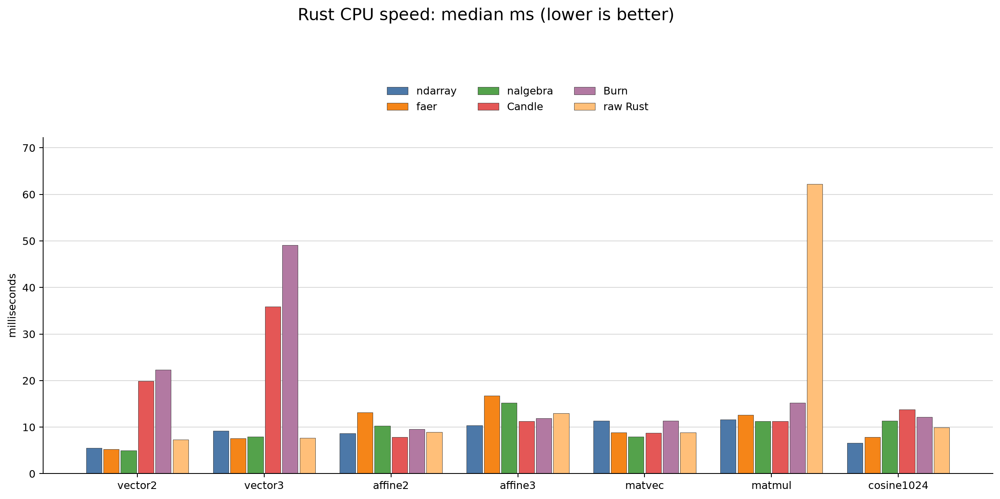

`eigh` は Candle と Burn が未対応です。rawはJacobi法の別実装なので、同じチャートに4系列で示します。

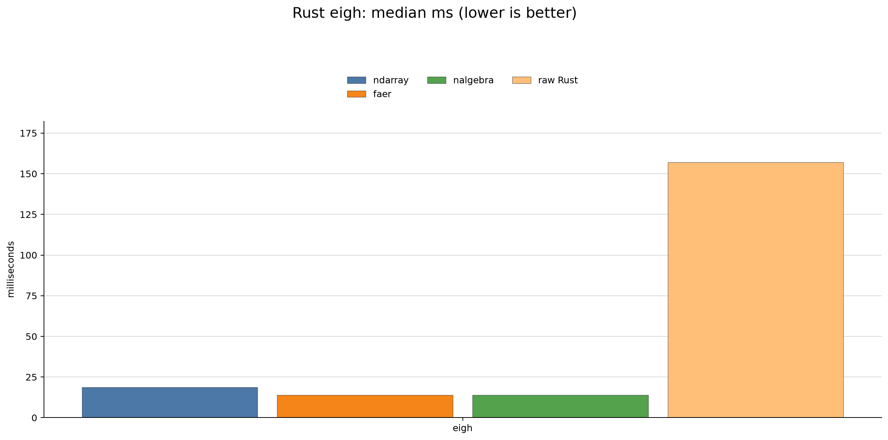

Python speed chart の系列は `NumPy` と `PyTorch` です。Python 側の解説と再現手順は [python/README.md](python/README.md) にもまとめています。


raw Pythonはライブラリ版と桁が異なるため、別スケールで示します。


追加言語のチャートも個別スケールで示します。特にJuliaとNode.jsは起動時間の影響を受けるため、インプロセスのカーネル速度とは分けて読みます。

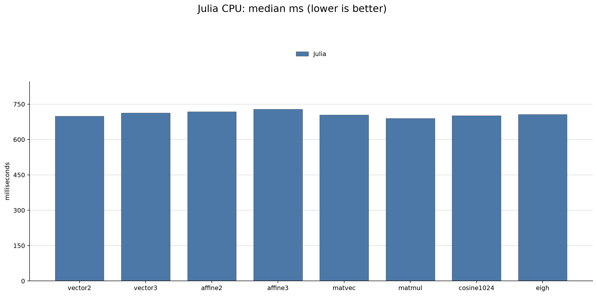

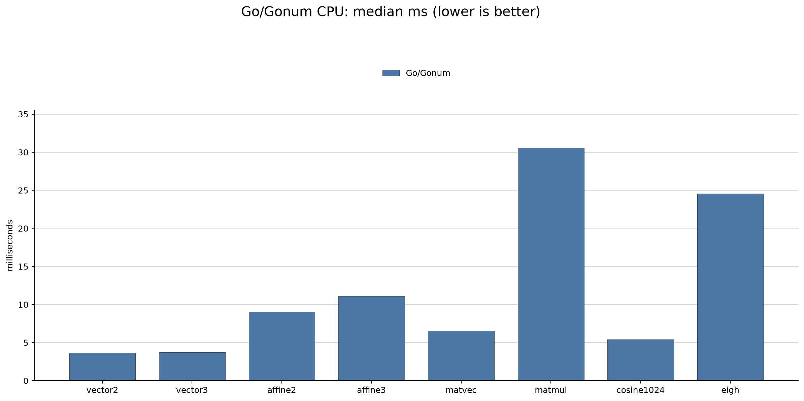

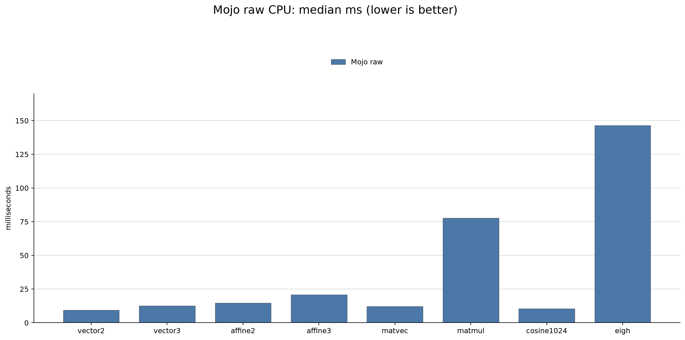

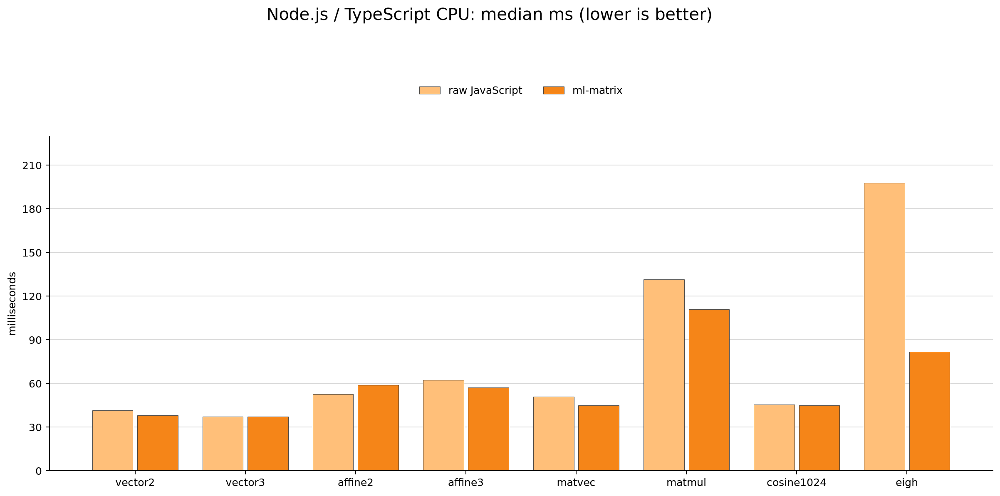

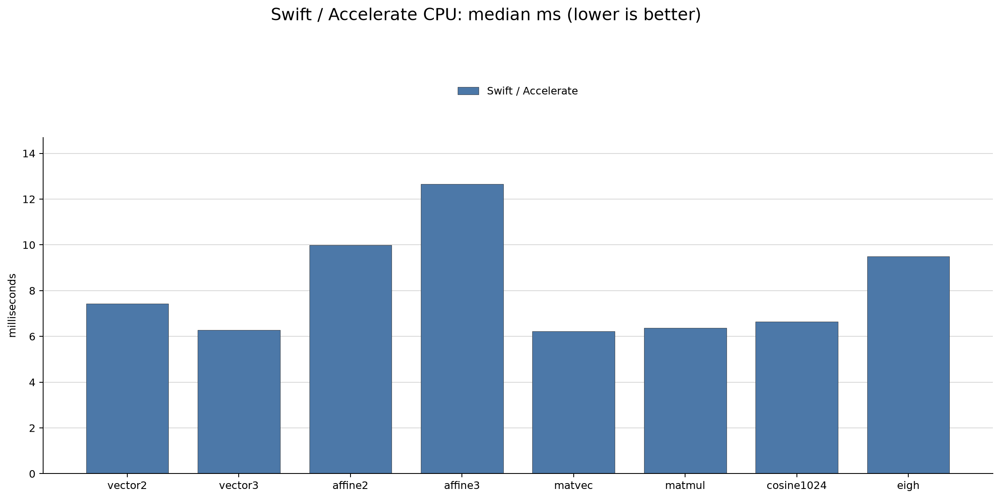

### Peak RSS

ピーク RSS は macOS の `/usr/bin/time -l` で測った値です。論理配列サイズや GPU メモリ使用量ではありません。単位は MiB です。raw backendはライブラリの初期化を行わないため、プロセス単位のRSSでは有利に見える場合があります。

ピークRSS（MiB、低いほど省メモリ）も全言語・全実装を1つの表にまとめています。🥇🥈🥉は各演算の1〜3位です。同値の場合は表の上から順に順位を付けています。

| backend | vector2 | vector3 | affine2 | affine3 | matvec | matmul | cosine1024 | eigh |
| --- | ---: | ---: | ---: | ---: | ---: | ---: | ---: | ---: |
| Rust / ndarray | 🥉 2.203 | 🥉 2.203 | 🥉 6.891 | 🥉 8.453 | 🥉 4.266 | 🥉 4.375 | 🥈 2.188 | 🥉 2.688 |
| Rust / faer | 2.250 | 2.219 | 14.578 | 14.625 | 4.266 | 4.469 | 2.234 | 3.188 |
| Rust / nalgebra | 🥇 2.109 | 🥇 2.109 | 🥈 6.781 | 🥈 8.312 | 🥈 4.172 | 🥈 4.328 | 🥉 2.188 | 🥈 2.562 |
| Rust / Candle | 2.562 | 2.672 | 7.062 | 8.594 | 4.469 | 4.719 | 2.500 | — |
| Rust / Burn | 3.094 | 3.312 | 12.109 | 15.203 | 7.141 | 6.109 | 2.828 | — |
| Rust / raw | 🥈 2.109 | 🥈 2.109 | 🥇 6.766 | 🥇 8.297 | 🥇 4.156 | 🥇 3.656 | 🥇 2.141 | 🥇 2.547 |
| Python / NumPy | 32.141 | 32.312 | 39.953 | 41.812 | 38.422 | 34.438 | 32.156 | 32.953 |
| Python / PyTorch | 203.609 | 204.469 | 212.188 | 214.906 | 210.500 | 206.484 | 205.109 | 205.609 |
| Python / raw | 26.703 | 26.688 | 41.609 | 49.328 | 31.766 | 29.031 | 26.734 | 26.734 |
| Julia | 286.594 | 285.219 | 290.625 | 291.469 | 286.844 | 288.188 | 284.359 | 286.969 |
| Go / Gonum | 3.969 | 3.984 | 9.375 | 10.953 | 6.109 | 5.688 | 4.031 | 4.547 |
| Mojo raw | 12.250 | 12.234 | 21.641 | 22.906 | 16.547 | 14.438 | 12.375 | 12.859 |
| Node.js / raw | 54.922 | 55.281 | 61.391 | 62.734 | 56.797 | 57.453 | 55.734 | 57.859 |
| Node.js / ml-matrix | 54.547 | 55.156 | 63.375 | 65.625 | 59.781 | 60.047 | 56.047 | 59.875 |
| Swift / Accelerate | 6.922 | 6.922 | 11.547 | 13.047 | 8.984 | 8.500 | 6.891 | 7.656 |

#### Peak RSS 合計ランキング（`eigh`除外）

同じ7演算について、各プロセスのPeak RSSを合計し、`total_rss_mib ASC`（合計が小さい順）で並べています。Peak RSSは演算ごとの別プロセスのピーク値なので、この合計は集計用の指標であり、同時実行時のメモリ消費量ではありません。

| rank | backend | total peak RSS (MiB) |
| ---: | --- | ---: |
| 1 | Rust / raw | 29.234 |
| 2 | Rust / nalgebra | 29.999 |
| 3 | Rust / ndarray | 30.579 |
| 4 | Rust / Candle | 32.578 |
| 5 | Go / Gonum | 44.109 |
| 6 | Rust / faer | 44.641 |
| 7 | Rust / Burn | 49.796 |
| 8 | Swift / Accelerate | 62.813 |
| 9 | Mojo raw | 112.391 |
| 10 | Python / raw | 231.859 |
| 11 | Python / NumPy | 251.234 |
| 12 | Node.js / raw | 404.312 |
| 13 | Node.js / ml-matrix | 414.578 |
| 14 | Python / PyTorch | 1457.265 |
| 15 | Julia | 2013.298 |

RustのRSSグラフは`eigh`を含む8演算です。Candle/Burnの`eigh`は未対応のため、その棒だけありません。

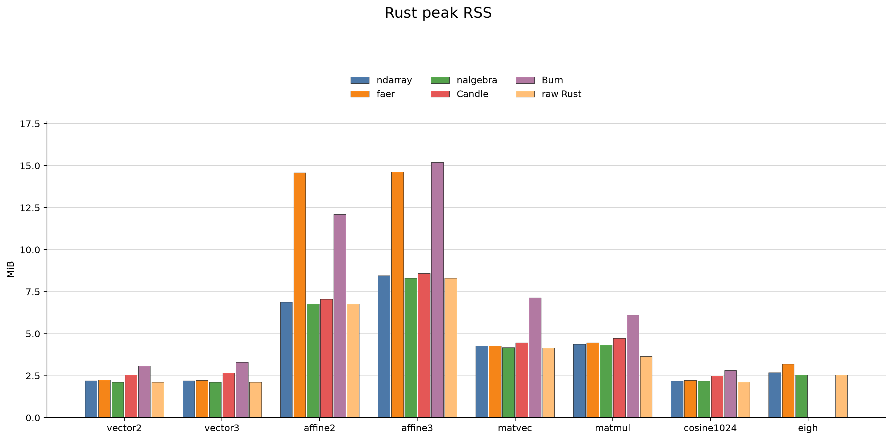

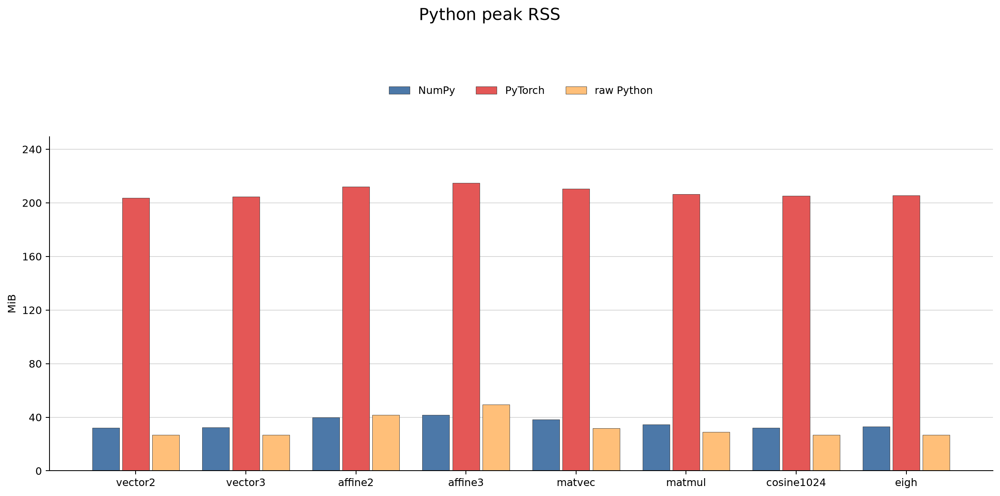

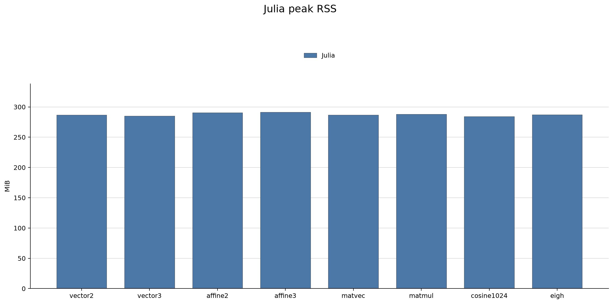

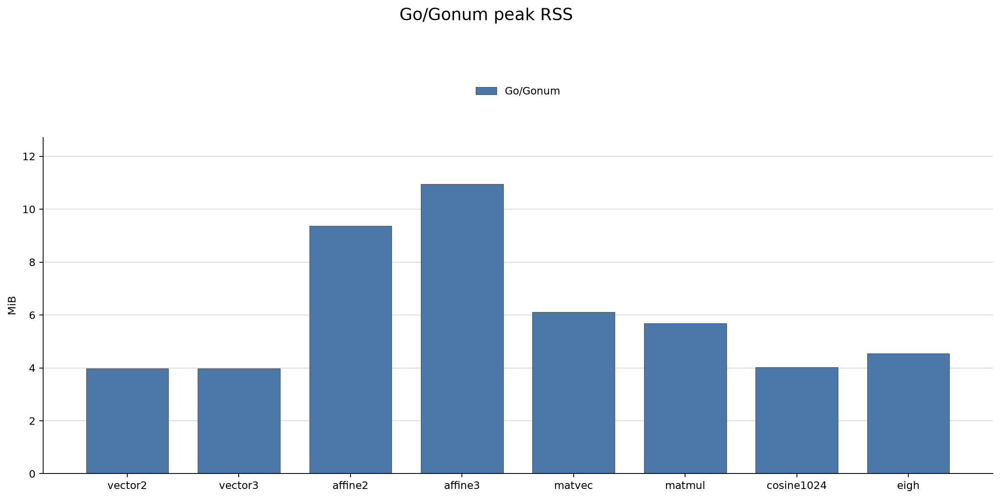

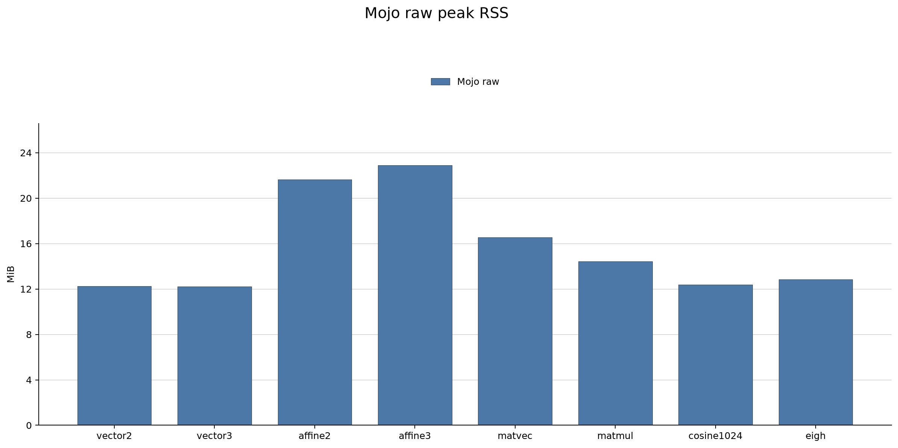

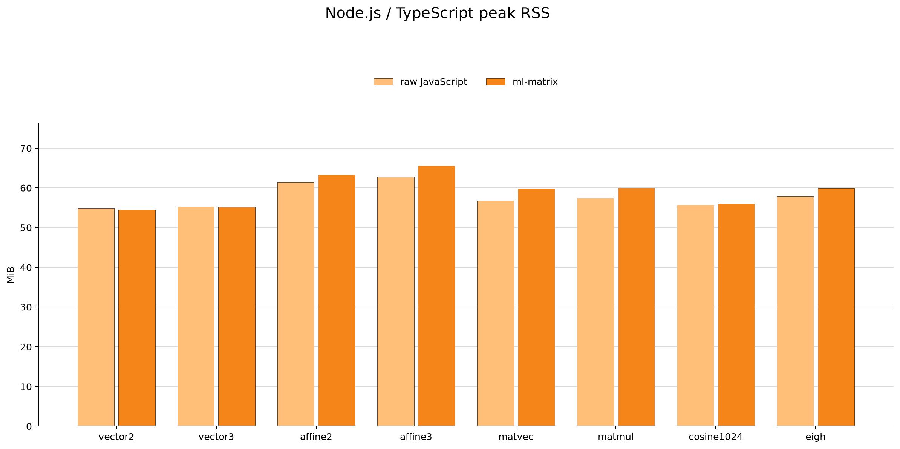

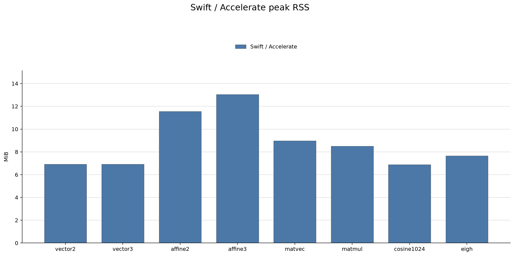

### 結果の読み方

- 小さい vector では Python のインタプリタ・Tensor API・scalar extraction、Rust のTensor graph/一時Tensorが支配的になり、単純な固定長型の `nalgebra` が有利です。今回のCPU snapshotではBurnはCandleより遅く、ピークRSSも大きくなりました。
- `affine2` と `affine3` は入力点数が多いため、Candle/Burnが低次元ベクトルより相対的に近づきます。
- `cosine1024` は埋め込み用途を想定した追加項目です。Rustでは`nalgebra`、PythonではNumPyがこのsnapshotで最速でしたが、差は環境とBLAS実装に依存します。
- raw Rust/Pythonは依存ライブラリを使わない代わりに、特にPythonの`matmul`と`eigh`で大きな差が出ます。これはインタプリタのループとJacobi法のコストを含む結果です。
- 追加言語では、SwiftのAccelerateとGo/Gonumが行列系で比較的低い中央値になりました。JuliaはCLI起動とランタイム初期化のRSS/時間が大きく、Mojo rawは依存なしの明示ループ、Node.jsの`ml-matrix`は行列と固有値分解のライブラリ経路として解釈します。
- `eigh` はライブラリのコンテナだけでなく、`ndarray-linalg`/OpenBLAS、`faer`、`nalgebra` の分解アルゴリズム差を含む比較です。rawのJacobi法は同じ表に置いていますが、アルゴリズムは別です。
- checksum は標準出力に出し、計算が捨てられないようにしています。丸め順が違うため、文字列の完全一致ではなく許容誤差で比較します。

## GPU について

`ndarray`、`faer`、`nalgebra`、Burnの`burn-ndarray`はこのベンチマークでは CPU 実装です。Candle は Metal/CUDA backend を持ちますが、今回の比較は `Device::Cpu` に固定しています。PyTorch も MPS/CUDA を使わず CPU Tensor に固定しています。CPU と GPU を同じ表に混ぜると、転送・warm-up・同期の影響が分からなくなるためです。

GPU 版を次に追加するなら、Candle Metal（Apple Silicon）または CUDA、BurnのWGPU/CUDA、PyTorch MPS/CUDAを別の測定カテゴリにします。少なくとも host-to-device、GPU 実行、device-to-host、warm-up、device memory peak を分けて記録します。候補は大量の `affine2/affine3`、`matvec`、十分大きい `matmul` で、固有値分解は GPU 対応アルゴリズムと収束条件を別途決めてから追加します。Burnは今回`burn-ndarray`のCPU backendに限定し、GPU backendのf64対応・同期方法・API差は未検証です。

## 次に加えると有用な項目

1. `f32`/`f64`の切り替えと、行列サイズを `8, 32, 128, 512, 2048` のように掃引する。
2. LU/QR/Cholesky分解と、分解を再利用する線形方程式 `Ax=b` の solve を測る。
3. `sum`、broadcast、in-place加算、slice/view、transposeなど、`ndarray`が得意な配列操作を別カテゴリで測る。
4. 疎行列のCSR/CSC、非連続stride、複数右辺の solve を追加する。
5. シリアルと並列を分け、スレッド数・CPU affinity・入力サイズを記録する。
