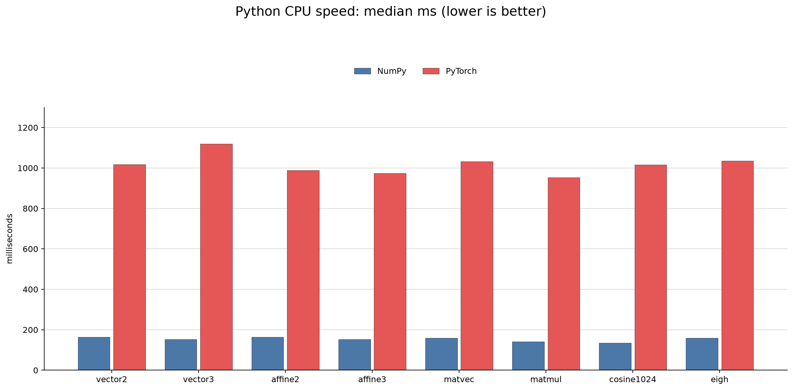
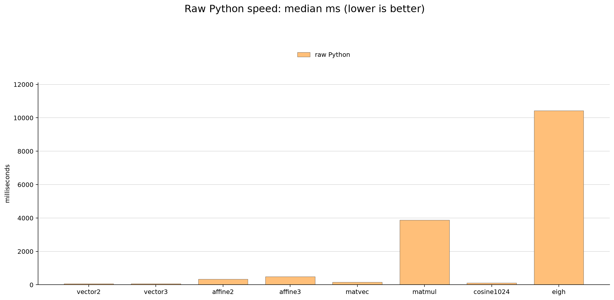

# ndbench Python comparison

This directory is an independent `uv` project that runs the same deterministic
double-precision calculations as the Rust `ndbench` binary with NumPy,
CPU-only PyTorch, and a dependency-free raw Python baseline.

## Setup

From this directory:

```sh
uv sync
```

The lockfile records the resolved Matplotlib/NumPy/PyTorch versions. The project uses a
managed Python in the supported range (`>=3.11,<3.14`) because native numerical
wheel availability varies by Python release.

On macOS, the PyTorch wheel is the normal upstream wheel for Apple Silicon and
the benchmark explicitly creates CPU tensors. It does not use MPS or CUDA. On
Linux, use a CPU-only PyTorch distribution/index if the environment provides a
CUDA-enabled wheel by policy; this benchmark never selects a GPU device.

## CLI

The CLI accepts `backend`, `op`, `size`, and `iterations`, and prints a
`checksum=...` line:

```sh
uv run python ndbench.py \
  --backend numpy --op matmul --size 256 --iterations 5

uv run python ndbench.py \
  --backend pytorch --op eigh --size 128 --iterations 1

uv run python ndbench.py \
  --backend raw --op matmul --size 256 --iterations 1
```

Supported operations are `vector2`, `vector3`, `affine2`, `affine3`, `matvec`,
`matmul`, `cosine1024`, and `eigh`. `size` means point count for affine
transforms and matrix order for matrix operations. It is unused by the vector
operations. `cosine1024` always uses two deterministic `f64` vectors of length
1024. The `vector2`/`vector3` operations include vector addition, dot product, L2 norm,
and (for 3D) cross product. `eigh` computes all eigenvalues and eigenvectors of
the real symmetric matrix with the lower triangle (`UPLO='L'`).

`numpy` and `pytorch` use the corresponding numerical libraries. `raw` (also
available as `native`) uses only Python lists, explicit loops, and
`math.sqrt`; it does not import NumPy or PyTorch. Its `eigh` operation is the
same dependency-free cyclic Jacobi baseline as the Rust `raw` backend.

The deterministic input formula and default values are copied from the Rust
implementation:

| operation | default size | default iterations | benchmark-script size/iterations |
| --- | ---: | ---: | ---: |
| `vector2`, `vector3` | 1 | 1,000,000 | 1 / 1,000,000 |
| `affine2`, `affine3` | 100,000 points | 1 | 100,000 / 5 |
| `matvec` | 128 | 1 | 512 / 10 |
| `matmul` | 128 | 1 | 256 / 5 |
| `cosine1024` | 1,024 | 1,000 | 1,024 / 1,000 |
| `eigh` | 128 | 1 | 128 / 5 |

The Rust benchmark's shell script uses the rightmost conditions for its normal
speed comparison, so `python/benchmark.sh` uses those same conditions.

## Speed and memory measurements

`benchmark.sh` runs `uv run` through `hyperfine`. Consequently each timed
command includes Python/uv process startup and deterministic input generation;
it is not an in-process kernel-only benchmark. It exports common BLAS thread
limits as `1`, and `ndbench.py` calls `torch.set_num_threads(1)` and
`torch.set_num_interop_threads(1)` before PyTorch tensor work.

```sh
HYPERFINE_RUNS=10 HYPERFINE_WARMUP=2 ./benchmark.sh
./memory.sh
```

The generated files are placed in `results/`:

- `<operation>.md` and `<operation>.json`: hyperfine speed results
- `memory.tsv`: peak RSS from macOS `/usr/bin/time -l`, or Linux `/usr/bin/time -v`

The following charts are the saved benchmark snapshot from this checkout's
macOS arm64 environment. It used `HYPERFINE_RUNS=5`, `HYPERFINE_WARMUP=2`, and
`VECTOR_ITERATIONS=10000`; all other sizes and iteration counts came from the
script defaults above. Times are medians in milliseconds and are
environment-dependent, so they should not be treated as portable constants.

The charts are Matplotlib grouped bar charts: backend bars are placed
side-by-side and identified by a legend. Raw Python is shown separately
because its `matmul` and `eigh` values require a much larger y-axis.





The raw hyperfine JSON/Markdown and RSS TSV are in `results/`. From the
repository root, regenerate the PNGs with:

```sh
uv run --project python python scripts/plot_results.py
```

## Fairness and checksum notes

- NumPy and PyTorch use `float64` CPU arrays/tensors; raw Python uses Python
  `float` values (IEEE-754 double precision on the supported CPython builds).
  All three use the same input formula and operation-level iteration counts as
  Rust.
- NumPy matrix inputs use Fortran order, matching the Rust ndarray benchmark's
  column-major arrays. PyTorch uses its normal CPU tensor layout.
- NumPy and PyTorch can use different BLAS/LAPACK kernels and reduction order,
  so checksums are compared with a floating-point tolerance rather than as
  byte-for-byte strings. The checksum prevents the result from being discarded.
- For tiny vector operations, Python dispatch and scalar extraction are part of
  the measurement. This is intentional for this command-level comparison, but
  it means the result answers “end-to-end CLI cost” rather than isolating a
  native vector instruction.
- Raw Python additionally includes explicit interpreter-level loops and list
  allocation. It is a baseline for dependency-free portability, not a
  recommendation for production matrix arithmetic.
- GPU execution, MPS, CUDA, and PyTorch GPU memory accounting are out of scope
  for this directory.
